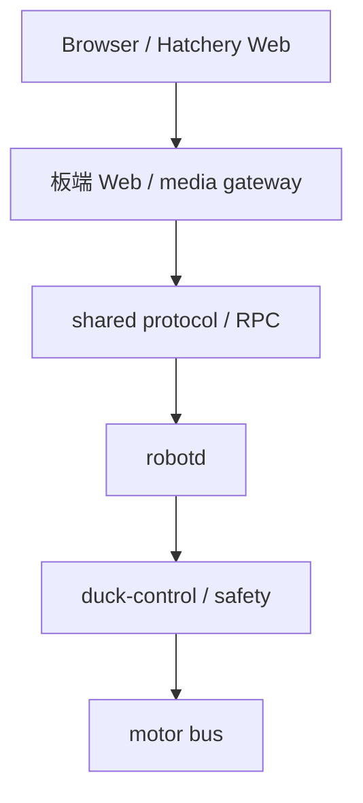

# Microduck Hatchery 当前结构与架构边界

主要依据是用户提供的 [microduck-hatchery-architecture-v2.md](microduck-hatchery-architecture-v2.md)。本文件解释当前落地状态，发生冲突按最新用户决定和 v2 处理。设备模块位于 `src/daemons` 和 `src/libraries`，保留完整 crate 边界。

2026-10-05 本轮范围：建立本地目录、隔离既有样例工具、修正启动和文档路径。未从官方仓库迁入源码，未建立 Cargo workspace、硬件驱动、部署单元或生产通信链路。

2026-10-07 Web 按最新用户要求加入独立的只读 3D 参考姿态模块，使用本地 Three.js 与带许可的网页显示模型；不改变设备权威、crate 边界或生产栈。模型与 ticks 到角度的映射仍为参考/演示，设备软件、真实校准与实机通信尚未实现；见 [联调说明](../web/docs/JOINT_COORDINATION.md)。

## 目录

```text
microduck-hatchery/
├─ src/
│  ├─ daemons/
│  │  └─ robotd/、updater/、configd/、btd/、padd/、mediad/、tof/
│  └─ libraries/
│     └─ duck-control/、robotd-params/、kinematics/、odometry/、
│        sounds/、pet-detect/、duck-detect/、pad-imu/、uyvy/
├─ protocol/
│  ├─ duck-ipc-proto/、duck-ble/
│  └─ mappings/、fixtures/、schemas/（既有样例 JSON）
├─ tools/
│  ├─ robotctl/、duckctl/、xtask/、test-support/、duck-ether/
│  ├─ hatchery-shell/
│  └─ check_shell.py
├─ web/              Hatchery 前端与设计包
├─ hardware/         实际硬件资料
├─ training/         保留所选训练源码内部结构的位置
├─ deploy/           部署说明与未来配置
├─ hooks/            安装钩子位置
├─ scripts/          hatchery-shell.py 与未来脚本
├─ spaces/           hello/、policy-playground/、shared/、vision-demo/
├─ docs/
└─ logs/
```

7 个 daemon、9 个 library、2 个 protocol、5 个官方工具的位置保持 v2。2026-10-10 按批准的 FD1985 方案新增 4 个可构建成员：duck-ipc-proto、duck-control、robotd、mediad，只实现本机只读维护子集；其余目录仍只有说明。`hooks/`、`spaces/` 不生成空实现，`training/`、`deploy/` 当前为说明入口。

分类不拆 crate、不改 crate 名，不创建新的 drivers、runtime、robot_io 或 libs 框架。`duck-control` 已在 `bus.rs` / `io.rs` 适配冻结 FT 只读包与解码；obs、policy、safety 的整机能力仍待正式源码与硬件基线，不能把只读子集当作完整控制栈。

## Radxa 整机与电脑维护

**Radxa Zero 3W 是主要运行平台。** Windows 的 FD1985 通过 FE-URT2 调试舵机；Hatchery 的 Windows / macOS 本地维护入口是辅助能力。装机后由电脑浏览器访问 Radxa gateway，权威仍在板端 robotd / duck-control。台架时使用本机最小维护服务，不启动整机策略、IMU、Camera 或其他 daemon。

当前 `robotd` / `mediad` binary 是上述职责中的只读子集，未迁入完整官方运行源码。loopback HTTP → 维护 RPC → robotd → duck-control 已用明确 fake 夹具验证；Radxa 网络 gateway、整机运控、HD 身份 / 寄存器及真实串口尚未验收。启动和接口见 [MAINTENANCE_BACKEND.md](MAINTENANCE_BACKEND.md)，FT 复用见 [FT_READ_ONLY_SOURCE.md](FT_READ_ONLY_SOURCE.md)。

## 正式控制关系

下图表示目标，尚未接通：



`web/` 只负责前端页面、目标草稿、展示缓存和只读回放。正式板端 gateway 放在对应设备模块，官方 `mediad/webclient` 后续保持在 `mediad` 内，作为控制语义和通信参考；不替代 Hatchery UI。协议库不依赖前端、硬件寄存器或 RL。

`robotd` 与 `duck-control` 保留官方的上层职责：生命周期、模式、状态、执行、控制循环和安全裁决。前端或 gateway 不能成为第二个权威控制器，不能直接写总线。命令接收、应用/读回和物理到位分别定义，逐关节结果由设备端产生。

## 当前可运行样例

Python 只读样例位于 [tools/hatchery-shell/](../tools/hatchery-shell/README.md)，不属于生产设备模块。仓库根 `src/` 按 daemons 与 libraries 分类。

启动入口是 `python scripts/hatchery-shell.py --port 8080`。工具读取根 `protocol/` 的样例 JSON，同源提供 `web/prototype/` 和未完成的 `web/shell/`。它只监听 loopback，明确返回 sample/fake/read-only 标记，不连接硬件、不执行目标，也不是正式 gateway 或 robotd 的实现。

`web/shell/app.js` 尚缺；完整检查无法通过。`--transport-only` 只核验样例服务和资源路径，不验证诊断页交互。现有 schema 与实际样例消息也有字段不一致，且依赖清单尚未列出检查/WS 所用 `websockets`；均保留为已知缺口，本轮不扩展功能或修改协议 JSON。

## 实际硬件边界

- 平台以 Radxa Zero 3W、FT / Feetech 和实际固件配置为准，不默认完整 Robot HAT 或官方设备节点。
- 后续移动或适配硬件代码前，先核对现有 FT 代码与冻结版本；优先复用 `bus.rs` / `io.rs` 等边界，不另造驱动框架，不让寄存器和串口细节进入 policy、observation 或 Web。
- UART、I2C、GPIO、Camera、IMU、ToF 的节点、权限和可用性由实物与配置确定。当前样例不证明任何设备可访问。
- 总线只能由当前活动控制后端占用；robotd 运行时，校准后端及其串口轮询都必须停止。读取同样需要仲裁，不能依靠进程内锁管理两个进程。
- FT 位置保留 ticks、负载保留 raw load；角度转换要求核对过的校准方向、零位和单位。Unix 与单调时间分开；真实/fake/sim 和 IMU 来源明确表达。
- `release` 不是停止或急停。失联、期限、取消和重连规则由设备端实现；回放不发送历史目标。

15 个物理关节包含 mouth #34，IMU #200 不计作关节。显示为左腿 → 右腿 → 头颈嘴，物理运行时与 14 维策略索引独立维护；样例映射不是实物校准结果。

## 后续引入源码时

`src/Cargo.toml` / `src/Cargo.lock` / `src/rust-toolchain.toml` 管理这 4 个真实只读成员；不为其余说明目录生成空 manifest。设备成员使用 `daemons/`、`libraries/` 相对路径，协议成员保持顶层 `protocol/duck-ipc-proto`，并以 package.workspace 显式指向 `../../src`。默认构建输出为 `src/target/`，本地启动器与合约测试按同一位置查找 binary。外部成员机制参考 [Cargo workspace 文档](https://doc.rust-lang.org/cargo/reference/workspaces.html)。

尚未分配关节的台架 ID（如 ID 1）只进入维护协议的 `unassigned_devices`，没有 runtime / policy 索引；15 个物理关节的映射不会由串口枚举或 PING 改写。只读维护允许显式指定最多 32 个独立总线 ID，拒绝重复和广播 ID，不进行自动扫描。

后续授权引入完整运行源码时保持 crate 整体，再核对 xtask 查根、脚本、hooks、systemd、CI 和测试资源路径；分类目录不能直接假设等于二进制安装路径。

运行部署需区分源码、发布文件、设备配置/校准、可变状态与临时 socket；具体路径和权限按 Radxa 镜像核对。`logs/` 保存开发记录及日志规则，不替代板端日志系统。

仿真、RL、标准策略导出、FT 运行时和实机验证仍属于必需全栈主线。`training/` 后续保留所选上游内部结构，浏览器不执行训练或策略推理。七章仍按 [共同审查方案](../web/docs/LOCAL_REVIEW_PROPOSAL.md) 推进；[联调](../web/docs/JOINT_COORDINATION.md) 已实现为本地样例，不能替代正式协议、校准或控制。WiFi、USB-C gadget 网络和 BLE 桥均需独立验收，BLE 不默认用于高频运动控制。

实施顺序见 [PLAN.md](PLAN.md)，来源见 [SOURCES.md](SOURCES.md)，实际验证见 [LOCAL_STATUS.md](../web/docs/LOCAL_STATUS.md)。
